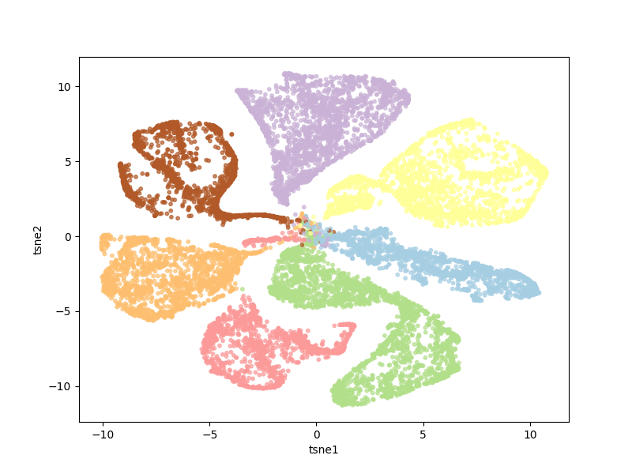
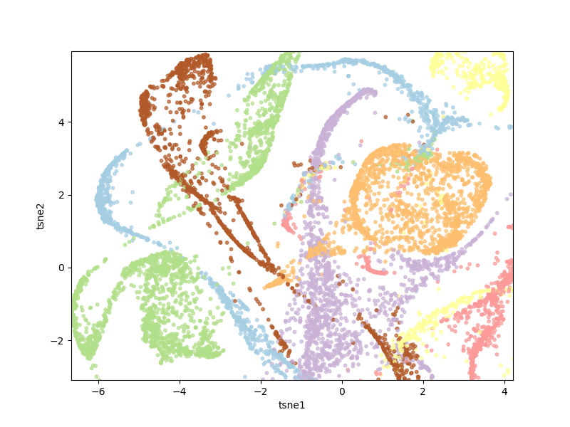
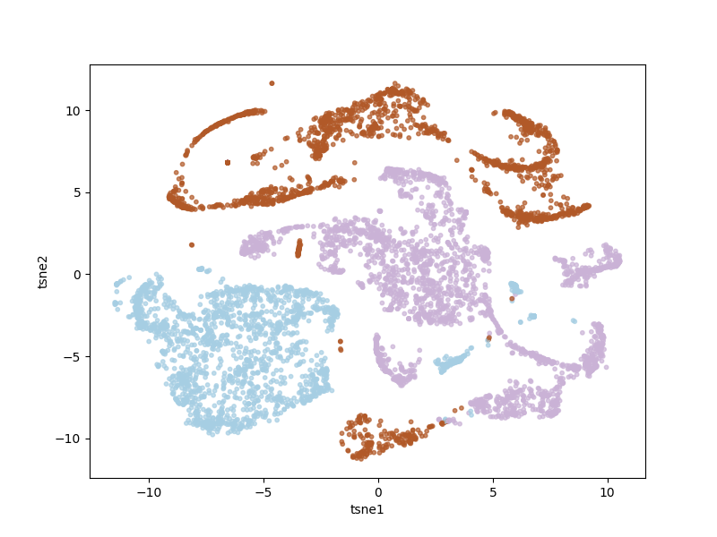
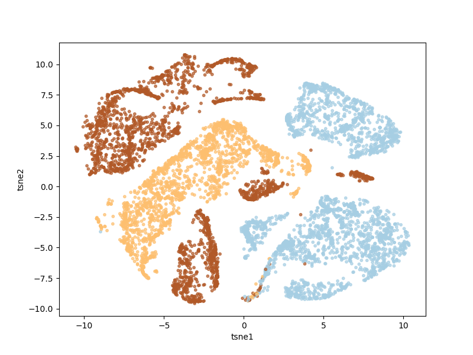

# shadowverse
shadowverseのデッキクラスタをt-sneで見るツールです  
細かい動作は[こちら](https://nosnosnosnos.github.io/journal/shadowverse.html)に載せています  

## 環境設定
python3 , fastText ,sklearn , numpy ,scipy , matplotlib 辺りが入っていれば動くと思います

## 使用方法
- python3 eval.py  
実行するとt-sneの実行結果を表示した散布図が表示されます  
表示された図をクリックすると、最も近い点(デッキ)のURLをコンソール上に出力します  
※メモリ3G程使用しますのでご注意ください

## データ収集からする場合
- twitterAPIを使用しますのでget_deck.pyにapikeyをセットします

- python3 get_deck.pyを実行  
実行すると、deck.pickleにデータが保存されます。 (APIの仕様上、直近2週間しか取れないので、多く取りたい場合は時間を置くか、プログラム内の検索ワードを変更してください)

- python3 convert_deck.pyを実行  
deck.datが出力されるので、それをfastTextに渡します

- ./fasttext skipgram -input deck.dat -output model -dim 200  
model.vecが出力されるので、このディレクトリに移動

- python3 eval.pyを実行  
  

